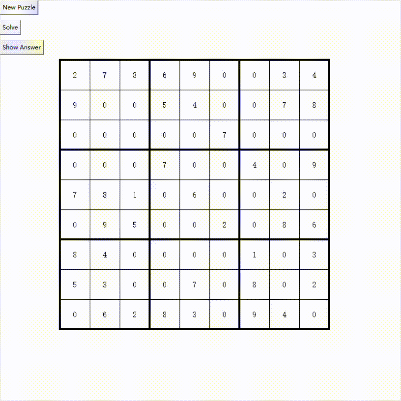

# sudoku

## Feature
* Back Tracking Method

## Function
* Algorithm.py is only the algorithm
* GUI.py is algorithm combined with tk interface

## Data
* Dataset from https://www.kaggle.com/datasets/rohanrao/sudoku
* Each game is a 81 length characters string which only contains(0-9), 0 means empty

